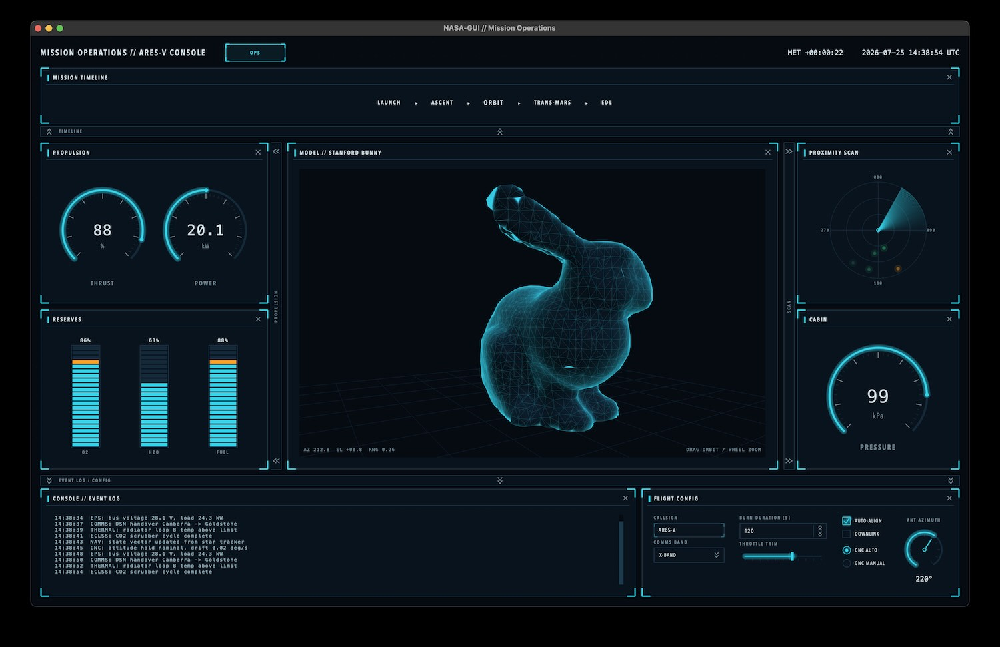

# nasagui

A Qt 6 / C++17 widget framework for building NASA / sci-fi mission-control
interfaces (inspired by modern NASA dashboard concepts and Territory Studio's
*The Martian* screen graphics): dark space-blue background, glowing cyan
primaries, amber warnings, corner-bracketed panels and monospaced readouts.

<center>
    <br>
</center><br/><br/>

## Build

```sh
cmake -S . -B build -DCMAKE_PREFIX_PATH=$HOME/Qt/6.8.3/macos
cmake --build build -j8
./build/nasagui_demo
```

`nasagui_demo --snapshot out.png` renders the dashboard for 2 s and saves a
screenshot. (`QT_QPA_PLATFORM=offscreen` works headless but cannot create an
OpenGL context, so the 3D viewport stays empty there.)

## Widgets

| Widget            | Purpose                                                        |
|-------------------|----------------------------------------------------------------|
| `HudPanel`        | Container with translucent fill, corner brackets and a header. `setClosable(true)` adds a ✕ that collapses the panel shut (animated); `openPanel()` expands it back; `panelClosed`/`panelOpened` signals keep menus in sync. |
| `CollapsibleDock` | Edge-anchored collapsible container (Left/Right/Top/Bottom) with an always-visible toggle strip and animated slide. |
| `CircularGauge`   | 270° arc gauge with ticks, glow arc and central readout.       |
| `BarGauge`        | Vertical segmented level bar (fuel / O2 style).                |
| `TelemetryPlot`   | Scrolling time-series with grid, glow stroke and gradient fill.|
| `StatusIndicator` | System name + status light (`Off/Nominal/Warning/Alert`; alert blinks). |
| `HudButton`       | Flat bordered button with corner ticks and hover glow.         |
| `RadarScope`      | Rotating-sweep radar with fading contacts.                     |
| `ModelView`       | OpenGL 3D viewport (rim-lit fill + cyan wireframe + floor grid) with orbit camera: drag to orbit, wheel to zoom, idle auto-rotate. |

### Interactive controls (`Controls.h`)

Drop-in replacements for the standard Qt controls — same API, HUD look:

| Widget           | Base class       | Notes                                        |
|------------------|------------------|----------------------------------------------|
| `HudCheckBox`    | `QCheckBox`      | Glowing check mark, hover highlight.         |
| `HudRadioButton` | `QRadioButton`   | Glowing dot indicator.                       |
| `HudComboBox`    | `QComboBox`      | Chevron field; popup styled by `applyTheme`. |
| `HudLineEdit`    | `QLineEdit`      | Corner ticks light up on focus.              |
| `HudSlider`      | `QSlider`        | Horizontal; glowing fill, bar handle, click-to-jump. |
| `HudSpinBox`     | `QDoubleSpinBox` | Chevron up/down zones; `setDecimals(0)` for ints (default). |
| `HudDial`        | `QDial`          | Mini-gauge look: track, glow arc, needle.    |
| `HudLabel`       | `QLabel`         | Typographic roles: `Title`, `Caption`, `Value`, `Unit`; `setAccent()` recolors. |

`QMenu`, `QMenuBar` and the `QComboBox` popup are styled globally by
`applyTheme()` — plain `menu->addAction(...)` code gets the HUD look for free
(see the "Ops" button in the demo header).

## Usage

```cpp
#include <nasagui/Style.h>
#include <nasagui/HudPanel.h>
#include <nasagui/CircularGauge.h>

int main(int argc, char *argv[])
{
    QApplication app(argc, argv);
    nasagui::applyTheme(app);          // dark palette + stylesheet, once

    auto *panel = new nasagui::HudPanel("Propulsion");
    auto *layout = new QHBoxLayout(panel);
    auto *gauge = new nasagui::CircularGauge;
    gauge->setRange(0, 100);
    gauge->setLabel("Thrust");
    gauge->setUnits("%");
    gauge->setWarnFrom(90);            // arc turns amber past 90
    layout->addWidget(gauge);
    panel->show();

    gauge->setValue(78.0);             // drive from your data source
    return app.exec();
}
```

Link against the static library: `target_link_libraries(myapp PRIVATE nasagui)`.

### Collapsible docks

Wrap any content in a `CollapsibleDock` and place it against an edge of your
layout; clicking its strip slides the content in/out (animated):

```cpp
auto *left = new nasagui::CollapsibleDock(
    nasagui::CollapsibleDock::Edge::Left, "Propulsion");
left->setExpandedSize(420);          // width for Left/Right, height for Top/Bottom
left->setContent(propulsionPanel);   // call repeatedly to stack several panels
left->setContent(reservesPanel);
middleLayout->addWidget(left);       // then addWidget(centralWidget, 1), right dock…

left->setExpanded(false);            // programmatic collapse; toggle() also works
```

### Closable panels + show/hide menu

```cpp
panel->setClosable(true);            // ✕ button in the header

QAction *act = panelsMenu->addAction(panel->title());
act->setCheckable(true);
act->setChecked(true);
QObject::connect(act, &QAction::toggled, panel, [panel](bool on) {
    on ? panel->openPanel() : panel->closePanel();
});
QObject::connect(panel, &nasagui::HudPanel::panelClosed, act, [act] {
    QSignalBlocker b(act); act->setChecked(false);   // ✕ keeps menu in sync
});
```

The demo's Ops ▸ Panels submenu does exactly this for all ten panels. Build
that submenu as a `HudMenu` (a `QMenu` subclass in `Controls.h`) and it stays
open while checkable items are clicked, so several panels can be toggled in
one visit.

A `CollapsibleDock` watches the `HudPanel`s handed to `setContent()`: closing
the last open panel auto-collapses the dock to its strip, and reopening any
panel expands it again.

### 3D model viewport

`ModelView` renders any indexed triangle mesh; normals are computed for you
and the orbit camera auto-fits the model:

```cpp
#include <nasagui/ModelView.h>
#include "BunnyMesh.h"   // demo/BunnyMesh.h — embedded Stanford bunny

// In main(), BEFORE constructing the QApplication (otherwise the widget's
// GL context cannot share with the window's default context on macOS and
// the viewport shows stale VRAM instead of the scene):
nasagui::ModelView::setDefaultSurfaceFormat();

auto *view = new nasagui::ModelView;
view->setMesh(bunny::positions, bunny::vertexCount,
              bunny::indices, bunny::indexCount);
view->setAutoRotate(true);   // slow idle spin (default on)
```

Left-drag orbits, the wheel zooms; an AZ/EL/RNG readout overlays the corner.
Requires the `Qt6::OpenGLWidgets` module (already linked by the library).

## Theming

All colors and fonts live in `include/nasagui/Theme.h`
(`Background`, `Primary` cyan, `Accent` amber, `Alert`, `Ok`, …).
Change them there to re-skin every widget at once.
`Theme::drawGlowPath()` is the shared neon-glow stroke helper if you write
your own widgets.

## Notes

- Qt 6.8 on recent macOS SDKs references the removed `AGL` framework;
  `CMakeLists.txt` strips it from the imported `WrapOpenGL` target.
